# AGENT_VF_LangGraph

Autonomous AI agent for professional thesis generation using LangGraph.

This project aims to develop an AI agent, AGENT_VF, capable of autonomously writing a complete professional thesis (Epitech "Mission Professionnelle" report). The agent leverages local LLMs (via Ollama), local vector stores, and the LangGraph framework for orchestrating complex, multi-step reasoning and generation processes.

## Project Vision

*   **Automated Thesis Generation:** Generate a comprehensive, well-structured, and coherent professional thesis.
*   **Input Sources:**
    *   School Deliverables/Guidelines (Epitech PDF).
    *   Apprenticeship Journal/Work Backlog (primary raw material, typically `.docx` files).
*   **Output:** A complete thesis document adhering to school guidelines.
*   **Core Principles:** Modularity, Robustness, Local First, Traceability, Iterative Refinement (HITL).

## Tech Stack

*   Python 3.11+
*   LangGraph
*   LangChain & Langchain Community
*   Ollama (with models like `gemma3:12b-it-q4_K_M`)
*   FastEmbed (with models like `BAAI/bge-small-en-v1.5`)
*   FAISS (for local vector store)
*   Poetry (for dependency management)
*   Ruff (for linting and formatting)
*   Pytest (for testing)
*   `unstructured[docx]` (for parsing `.docx` journal entries)

## Architecture

```mermaid
graph TD
    subgraph "📁 Données d'entrée"
        A["Directives PDF"] --> B["N1 Ingestion Guidelines"]
        C["Journal DOCX"] --> D["N2 Ingestion & Anonymisation"]
        E["Exemple Thèse"] --> B
    end
    
    subgraph "🧠 Mémoire & Index"
        D --> F["Chunks anonymisés"]
        F --> G["FastEmbed Embeddings"]
        G --> H["FAISS Vector Store"]
        H --> I["T1 Context Retriever"]
    end
    
    subgraph "🤖 Planification IA"
        B --> J["N3 Thesis Planner"]
        E --> J
        J --> K["ChatOllama LLM<br/>gemma3:12b"]
        K --> L["Plan structuré"]
    end
    
    subgraph "🔄 Pipeline de génération"
        L --> M["N4 Router"]
        M --> N["N5 Context Retrieval"]
        N --> I
        I --> O["Extraits pertinents"]
        O --> P["N6 Section Drafting"]
        P --> K
        K --> Q["Brouillon section"]
    end
    
    subgraph "✅ Validation"
        Q --> R["N7 Self Critique"]
        R --> S{"Qualité OK?"}
        S -->|Non| P
        S -->|Oui| T["N8 Human Review"]
        T --> U{"Approuvé?"}
        U -->|Non| P
        U -->|Oui| M
    end
    
    subgraph "📖 Finalisation"
        M --> V["N9 Bibliography"]
        V --> W["Document final"]
    end
    
    subgraph "💾 Persistance"
        X["LangGraph State"] --> Y["SQLite Checkpointer"]
        Y --> Z["Reprise thread"]
    end
    
    %% Configuration initiale
    AA["N0 Setup"] --> B
    AA --> D
    AA --> J
    
    %% Gestion état global
    X -.-> AA
    X -.-> J
    X -.-> M
    X -.-> P
    X -.-> R
    X -.-> T
    
    %% Styles
    style K fill:#ff9800,color:#fff
    style H fill:#2196f3,color:#fff
    style L fill:#9c27b0,color:#fff
    style W fill:#4caf50,color:#fff
    style X fill:#e91e63,color:#fff
    style T fill:#ffc107,color:#000
```



## Setup

1.  Ensure Python 3.11+ and Poetry are installed.
2.  Clone the repository:
    ```bash
    git clone <your-repo-url>
    cd AGENT_VF_LangGraph
    ```
3.  Install dependencies (including dev dependencies for testing and `unstructured` for DOCX processing):
    ```bash
    poetry install --all-extras
    ```
    *(Note: `--all-extras` will attempt to install optional dependencies. If you have issues, you might need to install `unstructured` and its docx dependencies separately or ensure your system has prerequisites like `libmagic` if `python-magic` is pulled in by `unstructured`)*.
    A more direct way if `--all-extras` causes issues:
    ```bash
    poetry install
    poetry add "unstructured[docx]" # For reading .docx journal files
    ```
4.  Activate the virtual environment:
    ```bash
    poetry shell
    ```
5.  **Set up Ollama:** Ensure Ollama is running and you have pulled the required LLM (e.g., `ollama pull gemma3:12b-it-q4_K_M`).
6.  **Prepare Data (Important - Not committed to Git):**
    *   Create the directory `data/input/school_guidelines/`.
        *   Place your school's thesis guidelines PDF here (e.g., `Mission_Professionnelle_Digi5_EPITECH.pdf`).
        *   Place the full text of the "Digi5" example thesis (or your reference example) as `Mémoire de Mission Professionnelle – Digi5.txt` in this folder.
    *   Create the directory `data/input/journal_entries/`.
        *   Place your apprenticeship journal files (preferably in `.docx` format) here. It's recommended to use a consistent naming convention like `YYYY-MM-DD.docx`. A script `scripts/rename_journals.py` is provided to help with this (use with caution after backing up your originals).
    *   The application will create `data/processed/` for the vector store and checkpoints.
7.  Set up necessary environment variables (e.g., in a `.env` file at the project root):
    ```env
    # Example .env content
    OLLAMA_BASE_URL="http://localhost:11434"
    # LLM_MODEL_NAME="gemma3:12b-it-q4_K_M" (can be overridden from config.py)
    # EMBEDDING_MODEL_NAME="BAAI/bge-small-en-v1.5" (can be overridden from config.py)
    ```
    (Refer to `src/config.py` for default values).

## Current Status & Next Steps (As of [Current Date])

*   **Core Pipeline N0-N6 Functional:**
    *   N0 (Initial Setup): Configures paths and models.
    *   N1 (Guideline Ingestor): Reads school guidelines PDF.
    *   N2 (Journal Ingestor & Anonymizer): Reads journal files (TXT and DOCX), chunks text, and creates/updates a FAISS vector store.
    *   N3 (Thesis Outline Planner): Generates a thesis outline using an LLM, based on guidelines and an example thesis. Fallback parsing for LLM JSON output is implemented.
    *   N5 (Context Retrieval): Retrieves relevant journal excerpts from the vector store using keywords from N3's plan.
    *   N6 (Section Drafting): Generates an initial draft for a thesis section using the plan from N3 and context from N5.
*   **Testing:** ~52 Pytest tests are passing, covering unit and basic integration logic for these nodes.
*   **Next Development Focus:**
    1.  **Qualitative Validation of N3-N5-N6 Pipeline:** In-depth analysis of the quality of the generated plan (N3), retrieved context (N5), and drafted section (N6) using real data and LLM calls. Iterative refinement of N3 and N6 prompts based on this analysis.
    2.  **N7_SelfCritiqueNode Development:** Implementing the self-critique mechanism (Reflexion pattern) to improve drafts from N6.
    3.  **N8_HumanInTheLoopNode Integration:** Fully integrating the human review and approval/modification loop with persistence.
    4.  **Full Graph Assembly & Plan-and-Execute Architecture:** Evolving the agent towards the proposed P&E architecture for enhanced robustness and strategic control.

## Running the Test Pipeline

A script `run_pipeline_n3_n5_n6.py` is available at the root to test the N0-N6 flow:
```bash
python run_pipeline_n3_n5_n6.py > outputs/pipeline_run.log 2>&1
